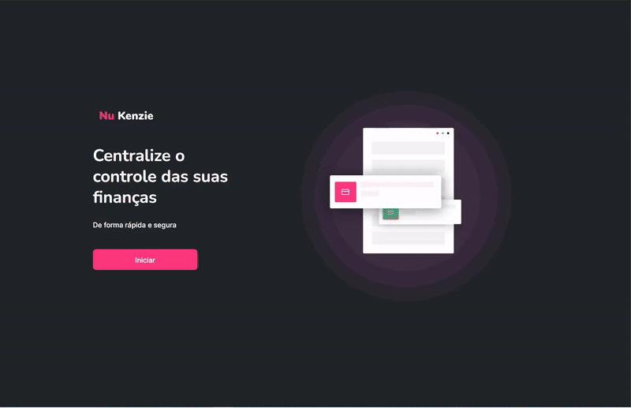

<!-- PROJECT LOGO -->
 

<h1 align="center">NuKenzie</h1>

  

    É uma plataforma de controle de gastos, onde é possível registrar uma descrição, um valor e o tipo desse valor (entrada ou saída).
     
  <a href="https://nu-kenzie-guiwustro.vercel.app/"> Link do Projeto
  </a>
  

<!-- ABOUT THE PROJECT -->

## Sobre o projeto

É uma plataforma de controle de gastos, onde é possível registrar uma descrição,
um valor e o tipo desse valor (entrada ou saída).   O usuário é capaz de
filtrar suas despesas e entradas, e o valor total é calculado dinamicamente de
acordo com o filtro selecionado.

## Tecnologias utilizadas

O projeto foi realizado em React e as bibliotecas utilizadas foram:

- Axios;
- Context API;
- React icons;

<!-- USAGE EXAMPLES -->

## Usabilidade

<!-- ROADMAP -->

## Features

- [x] Formulário para o usuário registrar uma nova entrada/saída;
- [x] Filtro de despesas e entradas;
- [x] Calculo dinâmico do valor total de acordo com o que está sendo filtrado
      (todos, entradas ou despesas) ;
- [x] Opção de remover entrada/despesa inserida;
- [x] Dark-mode;
- [x] Responsivo para todas as telas;
